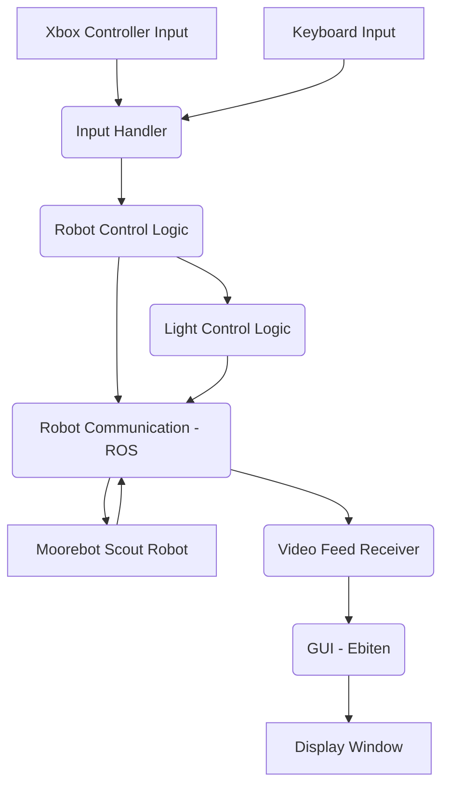

# Development Plan for go-scout

This document outlines the plan for documenting the `go-scout` repository, focusing on providing information for developers who will contribute to the project.

## 1. Introduction and Project Goals

- **Project Purpose:** `go-scout` is a tool that allows controlling a Moorebot Scout robot from a computer without using the mobile app.
- **Target Audience:** Developers contributing to the `go-scout` project.
- **Current State:** The project currently provides a basic GUI for video display and handles input from an Xbox controller and keyboard for robot control and basic light functionality.

## 2. Architecture Overview

The `go-scout` application consists of several key components that interact to control the robot and display its video feed.

- **GUI (Ebiten):** Handles the display of the video feed from the robot in a dedicated window.
- **Input Handling:** Processes input from connected Xbox controllers and the computer keyboard.
- **Robot Control Logic:** Translates input commands into actions for the robot.
- **Robot Communication (ROS):** Manages the communication link with the Moorebot Scout robot, likely using the ROS protocol.
- **Light Control:** Specific logic for controlling the robot's lights.

These components interact as follows:

## 3. Codebase Structure

The project's core functionality is primarily contained within a few Go files:

- `main.go`: This is the application's entry point. It contains the main game loop (`Draw`), initialization logic (`main`), functions for processing incoming messages (`onMessageFrame`), and the primary robot control functions (`robotControl` for joystick, `robotControlKeyboard` for keyboard). It also includes utility functions like `squashToFloat` and `saveScreenshot`.
- `lights.go`: This file contains functionality specifically for controlling the robot's lights, including the `turnOnLight` function.
- `go.mod` and `go.sum`: These files manage the project's Go module dependencies.

## 4. Dependencies

The project relies on external libraries, notably:

- **Ebiten:** Used for creating the graphical user interface and handling rendering.
- **ROS Client Libraries:** Libraries for communicating with the robot via the ROS protocol (specific libraries need to be identified from `go.mod`).

Dependencies are managed using `uv`. Developers should use `uv` for installing and managing project dependencies.

## 5. Robot Communication Details

Communication with the Moorebot Scout robot is handled via the Robot Operating System (ROS). The application connects to a specified ROS endpoint on the robot.

- The ROS endpoint (typically `IP_ADDRESS:PORT`) can be configured using the `-h` command-line flag when running the application.
- Messages are sent to and received from the robot through this ROS connection to control movement, access sensor data, and receive video feeds.

## 6. Input Handling Details

The application supports control via both an Xbox controller and the keyboard.

- **Xbox Controller:** Inputs from the left stick control forward/reverse movement and turning. The right stick controls strafing. Bumpers adjust speed and trigger stopping.
- **Keyboard:** Specific keys are mapped to actions like adjusting night vision brightness, saving screenshots, and returning the robot to its charging station.
- The mapping logic is primarily found within the `robotControl` and `robotControlKeyboard` functions in `main.go`.

## 7. Adding New Features

Developers looking to contribute can extend the project by:

- Implementing items from the existing "To-Do" list in the `README.md`:
  - Add support for other controllers.
  - Create a proper Heads-Up-Display (HUD).
  - Add support for more features of the robot (battery status, compass, sensor data to HUD).
- Adding new control mappings or robot interactions.
- Improving the GUI or video feed processing.

Understanding the existing input handling and robot communication logic is crucial for adding new features.

## 8. Building and Running for Development

To set up and run the project from source:

1.  Ensure Go and `uv` are installed.
2.  Clone the repository: `git clone https://github.com/shell-company/go-scout && cd go-scout`
3.  Install dependencies using `uv` (specific command TBD based on `go.mod` analysis, likely `uv sync` or similar).
4.  Build the application: `go build`
5.  Run the application, specifying the robot's ROS endpoint: `./scout -h "ROBOT_IP_ADDRESS:PORT"`

## 9. Robot Configuration Considerations

The `README.md` includes steps to potentially improve privacy and reduce resource usage on the robot itself. **These steps should be followed at your own risk**, as they may void warranties and potentially violate Moorebot terms of service.

- Gain SSH access to the robot (`ssh root@<SCOUT IP ADDRESS>`).
- Remove `/opt/sockproxy/proxy_list.json`.
- Disable the `sockproxy.service` using `systemctl disable sockproxy.service`.
- Null route specific IP addresses that appear to be related to the CloudNode (`route add ...`).
